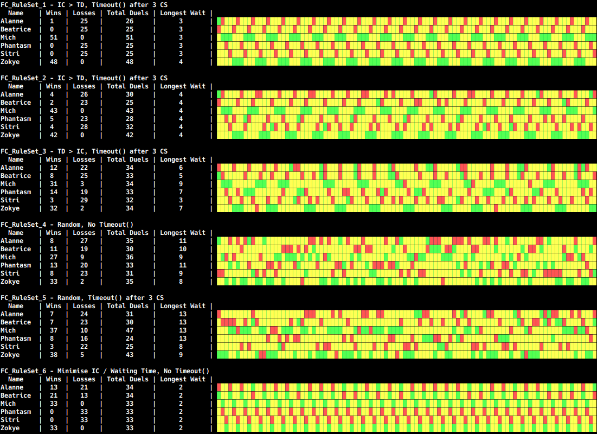

# Summon Helper

\Simple program to help hosts summon phantoms in a fair order.

Program to analyse the different FC rules
- [ ] finish FC_RuleSet_7
- [ ] test reading memory from DS process (use CE to find addresses)

Sample output:

